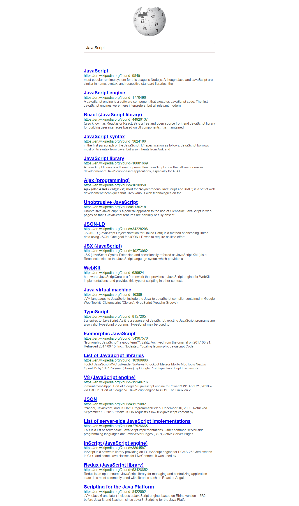

# WikiPedia Search Engine
> A simple WikiPedia based search engine that utilises WikiPedia API to list out results in the webpage😎.

This project as said above made the use of official open sourced API of [WikiPedia](https://www.mediawiki.org/wiki/API:Search). This web app lists out top 20 results(as constrained to 20 only in the API Query Parameter) on the result field in the webpage.

I tried to make this project to learn API handling in vanilla JavaScript.

This is the live [link](https://wikiquick.netlify.app/) in case you wanna try out(highly recommended😀).
I also request you to share your thoughts and feedbacks on my [EMail](mailto:raushankumar279878@gmail.com) or connect with me on [LinkedIn](https://linkedin.com/in/raushan-k/)😃.

**The App looks like below image(though it is the actual screenshot of the app lol!)**

